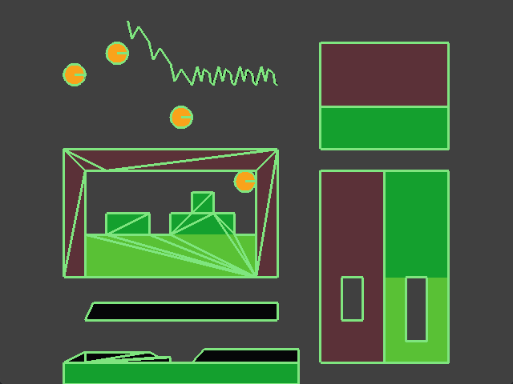

# gdx-ProjectTrianglePlatforming

A Tiled Layer Objects / Tile Collisions to Box2D Parser for libGDX

Thanks to [@nbNoxid](https://twitter.com/nbNoxid) for the projects name, thanks to [@Zooty6](https://github.com/zooty6) for help with one of the algorithms and for being a great rubber ducky.

---

[](https://github.com/lyze237/gdx-projecttriangleplatforming/blob/master/LICENSE)
[](https://jitpack.io/#lyze237/gdx-projecttriangleplatforming)
[](https://coffee.lyze.dev)

# What's this?

The library is a simple tool to generate box2d bodies based on various tiled objects and properties.

This includes:
1. Objects in a Layer

This takes all objects on a layer and converts them appropriately into Box2D shapes.

The supported map objects are:
* Rectangle
* Circle (=> Ellipse with width == height)
* Polygon
* Polyline (=> Unclosed polygon)

[Example:](https://github.com/lyze237/gdx-ProjectTrianglePlatforming/blob/master/src/test/java/gdxUnBox2d/lwjgl/tests/ObjectParserTest.java)
```java
var builder = new TiledObjectLayerToBox2d(TiledObjectLayerToBox2dOptions.builder()
        .scale(scale)
        .build());

builder.parseAllLayers(map, world);
```
 
| Tiled                                         | Box2D                                         |
|-----------------------------------------------|-----------------------------------------------| 
|  |  |

2.Tile collisions

This converts tileset collisions into Box2D shapes and combines them when possible into bigger polygons.


The supported map objects are:
* Rectangle
* Circle (=> Ellipse with width == height)
* Polygon
* Polyline (=> Unclosed polygon)

By default, all tiles try to merge as good as possible. If you want certain tiles not to merge you can change their `ptpMergeType` to anything you want and the algorithm groups them based on this name.

[Example:](https://github.com/lyze237/gdx-ProjectTrianglePlatforming/blob/master/src/test/java/gdxUnBox2d/lwjgl/tests/TileCollisionTest.java)
```java
var builder = new TiledTileCollisionToBox2d(TiledTileCollisionToBox2dOptions.builder()
        .scale(scale)
        .combineTileCollisions(true)
        .triangulateInsteadOfThrow(true)
        .build());

builder.parseAllLayers(map, world);
```

| Tiled                                                      | Box2D                                                      |
|------------------------------------------------------------|------------------------------------------------------------| 
|  |  |

3.Tiles in a layer

This just converts every tile in the layer into rectangles.

The algorithm tries to create rectangles as wide as possible, and then if possible also extends them down.

This reduces ghosting and is in my opinion the better way of doing it.

[Example:](https://github.com/lyze237/gdx-ProjectTrianglePlatforming/blob/master/src/test/java/gdxUnBox2d/lwjgl/tests/TileCollisionTest.java)
```java
var builder = new TiledTileLayerToBox2d(TiledTileLayerToBox2dOptions.builder()
        .scale(scale)
        .build());

builder.parseAllLayers(map, world);
```

| Tiled                                                       | Box2D                                                       |
|-------------------------------------------------------------|-------------------------------------------------------------| 
|  |  |

---

Additionally, there are a couple important features implemented:
* Scaling
* Triangulation of polygons when needed
* Merging of tiles and tile collisions to reduce ghosting issues

You can ignore an object, tile collision object, or tile by adding a custom boolean property `ptpIgnore` and set it to `true`.


And at last you can change the properties of the body or fixture setting the [appropriate properties](https://github.com/lyze237/gdx-ProjectTrianglePlatforming/blob/master/src/main/java/dev/lyze/projectTrianglePlatforming/BodyFixtureOptions.java#L12) of every object (and appending `ptp` to the property name).

For example you can change the bodies type by setting `ptpType` to any of the 3 available enums `StaticBody`, `KinematicBody`, `DynamicBody` or change the bullet option by setting `ptpBullet` to true.

---

## Installation

1. Open or create `gradle.properties` in the root folder of your project, add the following line:

```properties
ptpVersion=PTPVERSION
clipperVersion=CLIPPERVERSION
```

* Replace PTPVERSION with: [](https://jitpack.io/#lyze237/gdx-projecttriangleplatforming)
* Replace CLIPPERVERSION with: [](https://jitpack.io/#lyze237/gdx-Clipper2)

For example:

```properties
ptpVersion=0870dc3d97
clipperVersion=2faa7779bd
```

2. Add the jitpack repo to your build file.

```groovy
allprojects {
    repositories {
        // ...
        maven { url 'https://jitpack.io' }
    }
}
```

3. Add that to your core modules dependencies inside your root `build.gradle` file:

```groovy
project(":core") {
    // ...

    dependencies {
        // ...
        api "com.github.lyze237:gdx-projecttriangleplatforming:$ptpVersion"
        api "com.github.lyze237:gdx-Clipper2:$clipperVersion"
    }
}
```

## Html/Gwt project

1. Add the following lines to your html modules dependencies:

```groovy
implementation "com.github.lyze237:gdx-projecttriangleplatforming:$ptpVersion:sources"
implementation "com.github.lyze237:gdx-Clipper2:$clipperVersion:sources"
```

2. In your application's `.gwt.xml` file add (Normally `GdxDefinition.gwt.xml`):

```xml
<inherits name="dev.lyze.projectTrianglePlatforming"/>
```
